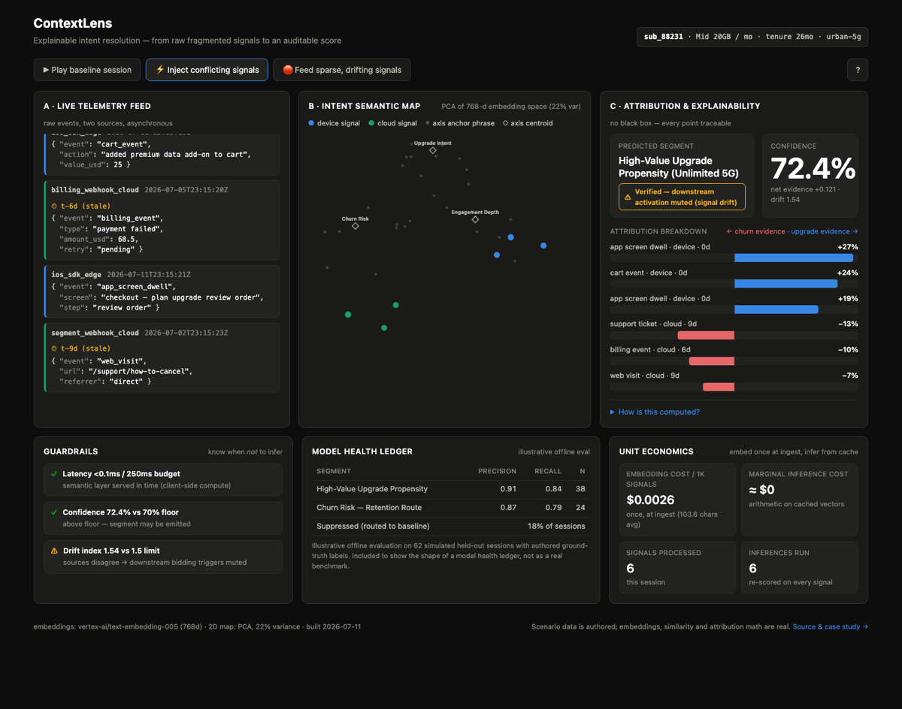

# ContextLens

**Explainable intent resolution — from raw fragmented signals to an auditable score.**

A working, interactive demo of how behavioral prediction can be made *legible*: raw
telemetry for one mock telco subscriber streams in from two fragmented sources (an
on-device SDK and cloud webhooks), maps into a shared semantic embedding space, and
resolves into a propensity score where **every percentage point is traceable to a
signal** — or, when the evidence doesn't support a prediction, into an explicit,
guardrailed refusal to predict.

**Live demo:** https://contextlens.hireme.jmkn.tech
(deep links: [`?play=baseline`](https://contextlens.hireme.jmkn.tech/?play=baseline) ·
[`?play=conflict`](https://contextlens.hireme.jmkn.tech/?play=conflict) ·
[`?play=sparse`](https://contextlens.hireme.jmkn.tech/?play=sparse))



## Why this exists

Enterprise buyers routinely stall or reject behavioral targeting products on one
objection: *"you can't tell me why the model said that."* Sales teams then either
over-promise ("the AI just knows") or under-sell. This project is a product
exploration of the counter: what does a scoring pipeline look like when
explainability, conflict handling, and knowing-when-not-to-infer are the product,
not an afterthought?

It's an independent portfolio project, inspired by the architecture that
intent-analytics platforms such as Intent HQ describe publicly (privacy-first
on-device signals fused with cloud event streams). It is not affiliated with or
endorsed by any company.

## The three scenarios

| Scenario | What happens | What it demonstrates |
|---|---|---|
| **Baseline session** (`?play=baseline`) | Fresh, coherent device + cloud signals | High-confidence prediction, full attribution, all guardrails green |
| **Asynchronous conflict** (`?play=conflict`) | Fresh on-device upgrade signals vs. week-old cloud churn signals (a cancel enquiry, a failed payment) | Exponential time decay resolves the tie; confidence honestly drops from ~93% to ~72%; the drift guardrail **mutes downstream activation** while sources disagree |
| **Sparse / drifting** (`?play=sparse`) | Weak, stale, ambiguous signals | Confidence falls below the 70% floor — the system routes to a general baseline and **emits no segment** rather than guessing |

Beyond the scripted scenarios:

- **Score your own signal** — type any event text (*"customer rang asking how to
  cancel"*), pick a source and staleness, and watch it embed live (Vertex AI),
  land on the semantic map, and move the score. Text is scored in memory, never
  stored, and rate-limited.
- **Counterfactual toggle** — flip **time decay off** (`?decay=0`) and re-score.
  In the conflict scenario the system loses its tie-breaker and drops to an
  indeterminate suppression: decay is what makes it decisive when it should be
  and humble when it shouldn't.
- **Tour mode** — narrated captions during playback for first-time viewers
  (toggleable).
- **Privacy boundary** — every device event shows what actually crossed to the
  cloud: a 3-number vector, not the raw payload. Cloud webhooks are labeled as
  server-side.

## What's real vs. what's simulated

Honesty table — this demo argues against black boxes, so it doesn't get to be one:

| Component | Real or simulated? |
|---|---|
| Scenario telemetry (the events themselves) | **Authored.** Hand-written to tell three specific stories, and worded so the embedding math produces the intended shapes. Disclosed here on purpose. |
| Embeddings | **Real.** Every signal and anchor phrase is embedded with a real model (Vertex AI `text-embedding-005`, or sentence-transformers MiniLM via `--local`). Nothing is hand-assigned a score. |
| Axis affinities (Upgrade Intent / Engagement Depth / Churn Risk) | **Real math.** Cosine similarity to anchor-phrase centroids, softmax-normalized. Precomputed by the pipeline. |
| Field-level attribution | **Real math.** Leave-one-out ablation: each payload field is removed, the signal re-embedded, and the cosine delta is that field's contribution. |
| Final score, confidence, drift, attribution shares | **Real math, computed live in your browser** from the precomputed affinities — the formulas are shown in the UI (“How is this computed?”). |
| 2D semantic map | **Real projection.** PCA of the embedding space (variance shown in the UI). |
| Model health ledger (precision/recall) | **Illustrative.** Labeled as such in the UI — scoring a simulator against its own authored ground truth would be circular theater. |
| Latency guardrail | **Real measurement, simulated stakes.** Actual client-side compute time against a 250ms budget. |
| Live signal scoring | **Real, end to end.** Your text → Vertex AI embedding → same centroids, same softmax, same PCA transform as the precomputed signals (`api/`, a small FastAPI service on Cloud Run). |

## How the score is computed

Each signal `i` gets a weight and a signed evidence value:

```
w_i        = trust(source) · e^(−λ · age_days)         λ = 0.13/day; trust: device 1.0, cloud 0.85
v_i        = affinity(upgrade_intent) − affinity(churn_risk)
net        = Σ w_i·v_i / Σ w_i
confidence = 100 · σ(k · |net|)
drift      = weighted_std(v_i) / drift_scale
```

`k` and `drift_scale` are readout constants calibrated per embedding backend
(different models spread their cosine similarities differently): `k=8,
drift_scale=0.19` for Vertex `text-embedding-005`, `k=4, drift_scale=0.30` for
MiniLM. `build.py` fails the build if the three scenarios stop hitting their
target confidence shapes.

Attribution share is each signal's fraction of total weighted evidence,
`|w_i·v_i| / Σ|w_j·v_j|` — so the attribution bars always decompose the score
exactly, and the UI's expandable math table shows every intermediate number.

The conflict tie-break is not a heuristic bolted on top: it *is* the time-decay
weight. A 9-day-old churn signal keeps its (real, embedding-derived) churn
affinity, but carries `e^(−0.13·9) ≈ 0.31×` the weight of a fresh signal.

## Guardrails — knowing when not to infer

Three rules, forming an escalation ladder the scenarios walk through:

1. **Latency budget (250ms).** Over budget → serve the cloud heuristic cache
   instead of the semantic layer.
2. **Drift limit (1.5).** Sources disagree beyond the limit → the prediction is
   still shown, but downstream bidding/activation triggers are **muted**. A
   prediction and permission to act on it are different things.
3. **Confidence floor (70%).** Below the floor → no segment is emitted at all;
   the user is routed to the general baseline.

## Architecture

```
pipeline/ (Python, runs once at build time)                 app/ (React SPA, no backend)
┌──────────────────────────────────────────────┐            ┌──────────────────────────┐
│ scenarios.py   authored raw telemetry        │            │ Vite + React + shadcn/ui │
│ anchors.py     axis anchor phrases           │            │ theme from Intent HQ's   │
│ build.py    →  embed (Vertex AI / MiniLM)    │──model.json→ public design tokens     │
│                cosine affinities, ablations, │            │ playback engine + live   │
│                PCA coords, calibration check │            │ scoring (same formulas)  │
└──────────────┬───────────────────────────────┘            └────────────┬─────────────┘
               │ scoring_assets.json                                     │ POST /score
               ▼                                                         ▼
┌──────────────────────────────────────────────────────────────────────────────────────┐
│ api/  FastAPI on Cloud Run — embeds free-text signals live (Vertex AI) against the   │
│ same centroids + PCA transform; rate-limited; nothing stored                          │
└──────────────────────────────────────────────────────────────────────────────────────┘
```

Embedding once at ingest and doing runtime inference as pure arithmetic on cached
vectors is also the unit-economics story: ~$0.003 of embedding per 1,000 signals,
and a marginal inference cost of approximately zero.


## How this maps to Intent HQ's published architecture

Intent HQ describes a seven-layer stack ("Seven layers. One architecture.",
[intenthq.com/deeptech](https://intenthq.com/deeptech), July 2026). Each ContextLens
element is a deliberately small analogue of one layer — the in-app "🗺 architecture"
dialog carries the same mapping:

| Intent HQ layer | ContextLens analogue | Deliberately simplified |
|---|---|---|
| 1 · Edge AI — *"context generated on the device, kept private by design"* | Device signals scored on-device; only the 3-axis vector crosses (feed privacy lines) | Precomputed scoring, not a real SDK |
| 2 · Deep Signal — *"behaviour at production scale, while the moment still matters"* | Async device + cloud telemetry feed | 5–6 authored events vs. 250B/day |
| 3 · Intent AI — *"the shape of a decision, not the record of an action"* | Semantic map + axis affinities: every signal becomes an intent vector | 3 axes, cosine-to-anchor scoring |
| 4 · Privacy Twins — *"the value of the signal without exposing the person"* | ε-budget control: real Laplace noise on vectors; confidence readout discounts certainty by noise variance | Illustrative k-anonymity cohort |
| 5 · Marketing Agents — *"detected intent into timely action"* | Agent-decision line: action queued, held by drift, or withheld | One next-best-action per verdict |
| 6 · IntentOne — governance hub | Guardrails panel: latency budget, confidence floor, drift mute | Three rules vs. a platform |
| 7 · Built to Scale — *"scale only matters if the intelligence stays individual"* | Unit-economics tiles | One user, not 320M profiles |

The ε slider is worth trying (`?eps=1` deep link): strong-evidence sessions survive a
tight privacy budget with an honest confidence haircut, while marginal-evidence
sessions (the conflict scenario) fall below the 70% floor and are suppressed —
privacy budget consumes the evidence margin first. That is the privacy-utility
tradeoff as an interactive control rather than a slide.

ContextLens is an independent exploration inspired by that public description — not
affiliated with, endorsed by, or representative of Intent HQ's implementation.

## Run it yourself

```bash
# 1. Precompute (local embedding model, no cloud account needed)
python -m venv .venv && .venv/bin/pip install -r pipeline/requirements.txt
cd pipeline && ../.venv/bin/python build.py --local

# 2. Run the UI (Vite dev server)
cd ../app && npm install && npm run dev
# open http://localhost:5173
```

`build.py` prints a calibration report and exits non-zero if the three scenarios
stop hitting their intended confidence shapes — edit `anchors.py` /
`scenarios.py` and re-run.

To use Vertex AI embeddings instead:

```bash
gcloud auth application-default login
../.venv/bin/python build.py --project YOUR_GCP_PROJECT
```

To run the live-scoring API locally (needs the Vertex build above, which also
writes `api/scoring_assets.json`):

```bash
GOOGLE_CLOUD_PROJECT=YOUR_GCP_PROJECT .venv/bin/python -m uvicorn main:app --port 8081 --app-dir api
```

## Deploy (Cloud Run)

```bash
gcloud run deploy contextlens --source app/ --region europe-west1 --allow-unauthenticated
```

The container multi-stage builds the Vite bundle and serves it with nginx; Cloud
Run scales it to zero between visits. (europe-west1 rather than London because
Cloud Run domain mappings aren't offered in europe-west2.) The UI is shadcn/ui
on a Tailwind theme whose tokens — warm espresso surfaces, corporate-yellow
primary, Barlow type — are derived from Intent HQ's public design language;
chart series colors are CVD/contrast-validated against the dark surface.

---

*Built as a product-thinking portfolio piece: the interesting decisions here are
which numbers to show, which to suppress, and how to earn trust in the ones that
remain.*
